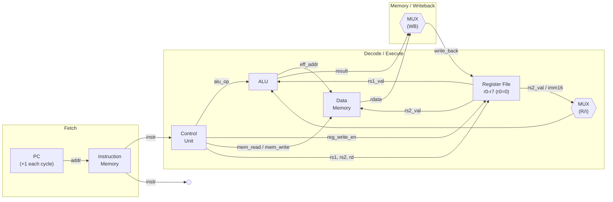
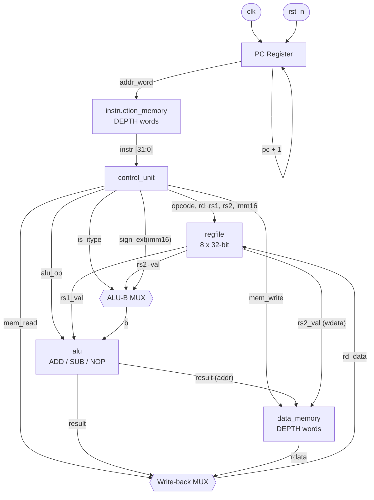
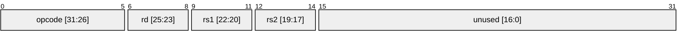
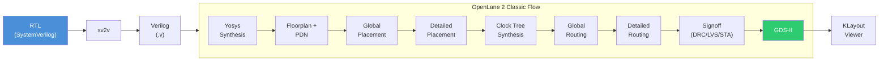

# Single-Stage (Single-Cycle) Processor

A 32-bit single-cycle CPU written in SystemVerilog, targeting **ASIC** flows with OpenLane 2 and open-source PDKs (Sky130, GF180MCU).

## CPU Microarchitecture



## Datapath Detail



## ISA Encoding



**R-type** (ADD, SUB): `[31:26] opcode | [25:23] rd | [22:20] rs1 | [19:17] rs2`

**I-type** (ADDI, LOAD, STORE): `[31:26] opcode | [25:23] rd/rs2 | [22:20] rs1 | [19:4] imm16`

| Opcode | Encoding | Description |
|--------|----------|-------------|
| NOP    | `000000` | No operation |
| ADD    | `000001` | `rd = rs1 + rs2` |
| SUB    | `000010` | `rd = rs1 - rs2` |
| ADDI   | `000011` | `rd = rs1 + sign_ext(imm16)` |
| LOAD   | `000100` | `rd = dmem[rs1 + sign_ext(imm16)]` |
| STORE  | `000101` | `dmem[rs1 + sign_ext(imm16)] = rs2` |

## ASIC Flow (RTL-to-GDS)



## Project Structure

```
.
├── Makefile                    # ASIC build/sim/lint targets
├── rtl/
│   ├── isa_defs_pkg.sv         # ISA package (opcodes, field extraction)
│   ├── alu.sv                  # ALU (ADD/SUB)
│   ├── regfile.sv              # 8x32 register file
│   ├── control_unit.sv         # Instruction decoder
│   ├── instruction_memory.sv   # IMEM (with TB write port)
│   ├── data_memory.sv          # DMEM (with TB read/write ports)
│   └── cpu_top.sv              # Top-level CPU
├── tb/
│   └── top_tb.sv               # Top testbench
├── asic/
│   ├── config.json             # OpenLane 2 configuration
│   ├── src/                    # sv2v-converted Verilog (generated)
│   └── runs/                   # OpenLane run outputs
└── sim/
    └── program.hex             # Optional preload program
```

## Prerequisites

| Tool | Used for |
|------|----------|
| **OpenLane 2.3.9** | ASIC RTL-to-GDS flow (local install) |
| **Sky130 / GF180MCU PDK** | Process design kits (via volare) |
| **sv2v** | SystemVerilog-to-Verilog conversion |
| **Yosys** | Local synthesis sanity check |
| **Verilator** | RTL linting |
| **Icarus Verilog** | Open-source simulation |
| **KLayout** | GDS viewing |

## Quick Start

### ASIC Flow (OpenLane 2)

The Makefile uses a local OpenLane 2 install with PDK selectable via `PDK=`:

```bash
# Default PDK is sky130A — override with PDK=<variant>
# Valid: sky130A, sky130B, gf180mcuA, gf180mcuB, gf180mcuC, gf180mcuD

make synth                     # Synthesis + STA pre-PNR
make floorplan                 # Synthesis → Floorplan + PDN
make placement                 # Synthesis → Detailed placement
make cts                       # Synthesis → Clock tree synthesis
make routing                   # Synthesis → Detailed routing
make gds                       # Full RTL-to-GDS (default target)
make gds PDK=gf180mcuD         # Full flow with GF180MCU

make gds-view                  # Open final GDS in KLayout

make report-synth              # View synthesis timing reports
make report-cts                # View CTS timing reports
make report-routing            # View routing timing reports
make report-timing             # View signoff STA reports
```

Each stage target is cumulative — it runs all prior stages up to that point. Use `TAG=<name>` to manage multiple runs:

```bash
make cts PDK=sky130A TAG=experiment1
```

### Preparation & Simulation

```bash
make sv2v                      # Convert SystemVerilog to Verilog
make yosys-check               # Quick Yosys synthesis sanity check
make lint                      # Verilator lint check
make iverilog-sim              # Compile & run with Icarus Verilog
```

### Cleanup

```bash
make gds-clean                 # Remove ASIC run outputs
make clean                     # Remove all generated files
```

## Target Platforms

| Parameter | Value |
|-----------|-------|
| **PDKs** | SkyWater Sky130 (130 nm), GlobalFoundries GF180MCU (180 nm) |
| **Clock** | 40 MHz (25 ns period) |
| **Flow** | OpenLane 2.3.9 (Classic) — local install, no Docker |
| **Output** | `asic/runs/<tag>/results/final/gds/cpu_top.gds` |

The ASIC flow uses 64-entry memories (parameterised down from 1024) so they synthesise as flip-flop arrays. A production design would replace these with SRAM macros (e.g. via OpenRAM).

## License

Licensed under the [Apache License 2.0](LICENSE). The Sky130 PDK is separately licensed under Apache 2.0 by Google/SkyWater. The GF180MCU PDK is licensed under Apache 2.0 by GlobalFoundries.
