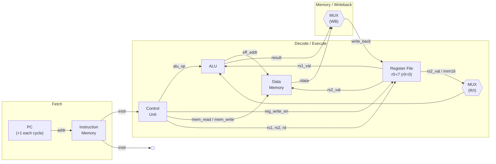
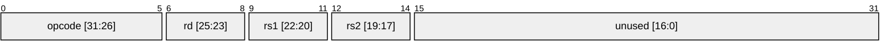
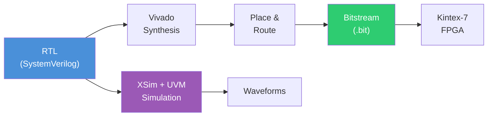
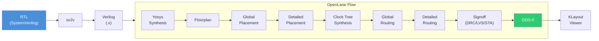
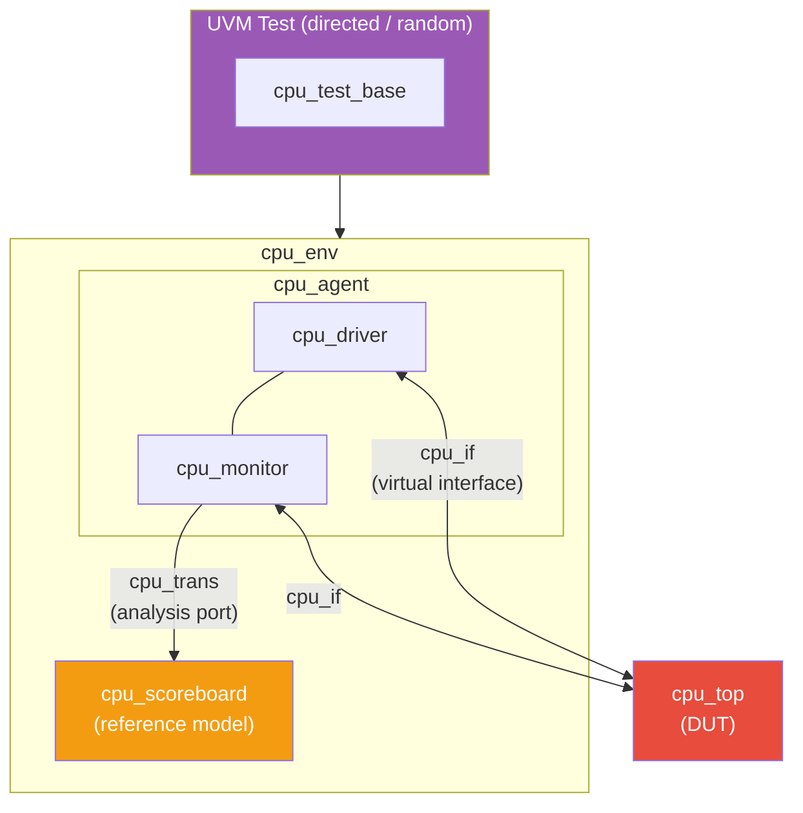

# Single-Stage (Single-Cycle) Processor

A 32-bit single-cycle CPU written in SystemVerilog, targeting both **FPGA** (Xilinx Vivado / Kintex-7) and **ASIC** (Sky130 via OpenLane) flows.

## CPU Microarchitecture



## Datapath Detail


## ISA Encoding



**R-type** (ADD, SUB): `[31:26] opcode | [25:23] rd | [22:20] rs1 | [19:17] rs2`

**I-type** (ADDI, LOAD, STORE): `[31:26] opcode | [25:23] rd/rs2 | [22:20] rs1 | [19:4] imm16`

| Opcode | Encoding | Description |
|--------|----------|-------------|
| NOP    | `000000` | No operation |
| ADD    | `000001` | `rd = rs1 + rs2` |
| SUB    | `000010` | `rd = rs1 - rs2` |
| ADDI   | `000011` | `rd = rs1 + sign_ext(imm16)` |
| LOAD   | `000100` | `rd = dmem[rs1 + sign_ext(imm16)]` |
| STORE  | `000101` | `dmem[rs1 + sign_ext(imm16)] = rs2` |

## Design Flows

### FPGA Flow



### ASIC Flow (RTL-to-GDS)



### UVM Testbench Architecture



## Project Structure

```
.
├── Makefile                  # All build/sim/ASIC targets
├── rtl/
│   ├── isa_defs.sv           # ISA package (opcodes, field extraction)
│   ├── alu.sv                # ALU (ADD/SUB)
│   ├── regfile.sv            # 8x32 register file
│   ├── control_unit.sv       # Instruction decoder
│   ├── instruction_memory.sv # IMEM (with TB write port)
│   ├── data_memory.sv        # DMEM (with TB read/write ports)
│   └── cpu_top.sv            # Top-level CPU
├── tb/
│   ├── top_tb.sv             # Top testbench (clock, reset, UVM entry)
│   └── uvm/                  # UVM verification environment
├── scripts/                  # Vivado TCL scripts
├── asic/
│   ├── config.json           # OpenLane configuration (Sky130)
│   ├── src/                  # sv2v-converted Verilog (generated)
│   └── runs/                 # OpenLane run outputs
│       └── run/results/final/
│           └── gds/cpu_top.gds
└── sim/
    └── program.hex           # Optional preload program
```

## Prerequisites

| Tool | Used for |
|------|----------|
| **Vivado 2025.2** | FPGA synthesis, implementation, simulation (XSim) |
| **Yosys** | Local synthesis sanity check |
| **sv2v** | SystemVerilog-to-Verilog conversion for ASIC tools |
| **Verilator** | RTL linting |
| **Icarus Verilog** | Open-source simulation |
| **GTKWave** | Waveform viewing |
| **Docker** | Runs OpenLane for RTL-to-GDS |

## Quick Start

### FPGA Flow (Vivado)

```bash
make project          # Create Vivado project (Kintex-7 xc7k70tfbv676-1)
make sim              # Run behavioural simulation (XSim + UVM)
make synth            # Run synthesis (reports in reports/)
make impl             # Run implementation / place & route
make bitstream        # Generate bitstream
make gui              # Open project in Vivado GUI
```

### ASIC Flow (OpenLane + Sky130)

```bash
make gds-setup        # One-time: pull Docker image + fetch Sky130 PDK
make yosys-check      # Quick local synthesis sanity check
make gds              # Full RTL-to-GDS (synthesis -> floorplan -> PnR -> DRC -> GDS)
make gds-view         # Open GDS in KLayout
```

The ASIC flow uses 64-entry memories (parameterised down from 1024) so they synthesise as flip-flop arrays. A production design would replace these with SRAM macros (e.g. via OpenRAM).

### Open-Source Simulation & Lint

```bash
make lint             # Verilator lint check
make iverilog-sim     # Compile & run with Icarus Verilog
```

### Cleanup

```bash
make clean            # Remove all generated files
make gds-clean        # Remove only ASIC run outputs
```

## Target Platforms

### FPGA

- **Device**: Xilinx Kintex-7 `xc7k70tfbv676-1`
- **Clock**: 100 MHz (10 ns period)

### ASIC

- **PDK**: SkyWater Sky130A (130 nm, open-source)
- **Clock**: 40 MHz (25 ns period)
- **Standard cell library**: `sky130_fd_sc_hd`
- **Flow**: OpenLane v1.1.1 (classic) via Docker
- **Output**: `asic/runs/run/results/final/gds/cpu_top.gds`

## License

Licensed under the [Apache License 2.0](LICENSE). The Sky130 PDK is separately licensed under Apache 2.0 by Google/SkyWater.
